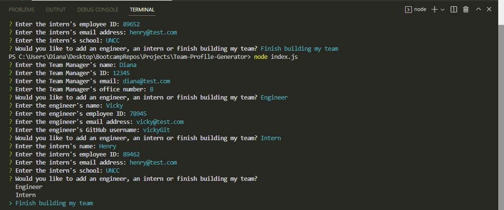
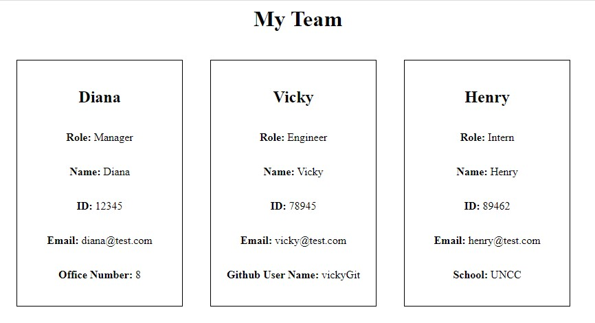

# Team-Profile-Generator

 
## Description

The Team Profile Generator is a command-line application that accepts user input information about employees on a software engineering team and generates an HTML webpage that displays summaries for each person.

## Table of Contents

- [Installation](#installation)
- [Usage](#usage)
- [Contributing](#contributing)
- [License](#license)

## Installation

To install my project use the following link: https://github.com/dianavw8/Team-Profile-Generator and follow these simple directions:

Above the list of files, click on the "Code" button.

Copy the URL for the repository.

Open Git Bash.

Change the current working directory to the location where you want the cloned directory.

Type git clone, and then paste the URL you copied earlier.

Press Enter to create your local clone.

For more help and information achiving this, check out the following website: https://docs.github.com/en/repositories/creating-and-managing-repositories/cloning-a-repository

## Usage

The refactored website can be found at: https://dianavw8.github.io/Team-Profile-Generator/

The walkthrough video of the command-line functionality can be seen at: https://drive.google.com/file/d/1HXxSdoGmLtwryPIV0ScwdQQagFEagEgo/view 

The following image demonstrates the application's appearance and functionality in the Terminal:

The following image demonstrates the application's appearance:

## License

MIT License link: https://github.com/babel/babel/blob/master/LICENSE

## Contributing

The following are contributers to the making of my Professional README Generator:

https://shields.io/

https://choosealicense.com/

https://coding-boot-camp.github.io/full-stack/github/professional-readme-guide

https://opensource.org/licenses

